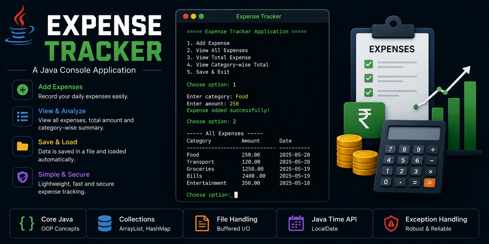

<p align="center">
  
</p>

<h1 align="center">💰 Expense Tracker</h1>

<p align="center">
A simple Java console-based application to record, manage, and analyze daily expenses using Object-Oriented Programming, File Handling, and Collections Framework.
</p>

<p align="center">
  
  
  
  
</p>

---

# 📖 Overview

Expense Tracker is a lightweight Java console application that helps users manage their daily expenses. It allows users to add expenses, view all recorded expenses, calculate the total expenditure, and generate category-wise summaries.

The application stores expense records locally in a text file, ensuring that data is available even after restarting the program.

This project was developed to strengthen Core Java concepts including Object-Oriented Programming, Collections Framework, File Handling, Exception Handling, and Java Time API.

---

# ✨ Features

### ➕ Add Expense

- Add a new expense
- Category validation
- Positive amount validation
- Automatically stores the current date

---

### 📋 View All Expenses

Displays all recorded expenses in a tabular format including:

- Category
- Amount
- Date

---

### 💵 Total Expense

Calculates the total amount spent across all recorded expenses.

---

### 📊 Category-wise Summary

Displays total expenses grouped by category using Java HashMap.

Example:

```
Food          : 1200.00
Travel        : 850.00
Shopping      : 1500.00
```

---

### 💾 File Storage

- Saves all expenses into `expenses.txt`
- Automatically loads existing expenses when the application starts

---

### ✅ Input Validation

- Prevents empty categories
- Prevents invalid numeric input
- Prevents negative or zero expense amounts
- Handles invalid menu choices gracefully

---

# 🛠 Tech Stack

- Java
- Object-Oriented Programming (OOP)
- Collections Framework
- ArrayList
- HashMap
- File Handling
- Exception Handling
- Java Time API (`LocalDate`)
- BufferedReader / BufferedWriter

---

# 📂 Project Structure

```text
Expense-Tracker
│
├── src
│   └── com
│       └── expensetracker
│           ├── Expense.java
│           └── ExpenseTracker.java
│
├── expenses.txt
├── README.md
└── expense-tracker.png
```

---

# 🚀 Getting Started

## Clone Repository

```bash
git clone https://github.com/Jahnavi-Avadhuta/Expense-Tracker.git
```

---

## Open Project

Import the project into Eclipse, IntelliJ IDEA, or VS Code.

---

## Compile

```bash
javac Expense.java ExpenseTracker.java
```

---

## Run

```bash
java com.expensetracker.ExpenseTracker
```

---

# 🎮 Menu

```
===== Expense Tracker Application =====

1. Add Expense
2. View All Expenses
3. View Total Expense
4. View Category-wise Total
5. Save & Exit
```

---

# 📸 Preview

A project banner is included above.

Future versions will include console screenshots and GIF demonstrations.

---

# 🚀 Future Enhancements

- Edit existing expenses
- Delete expenses
- Monthly reports
- Budget planning
- Expense filtering by date
- Export to CSV
- Charts and visual analytics
- GUI version using JavaFX or Swing
- Database integration using MySQL
- User authentication

---

# 📚 Learning Outcomes

This project helped strengthen my understanding of:

- Object-Oriented Programming
- Collections Framework
- File Handling
- Exception Handling
- Java Time API
- Data Persistence
- Console Application Development
- Clean Code Practices

---

# 👩‍💻 Developer

**Jahnavi Avadhuta**

Computer Science Graduate

Software Engineer | Java | Spring Boot | Python | AI & Data Science Enthusiast

🌐 Portfolio: [**YOUR_PORTFOLIO_URL**](https://portfolio-website-zeta-blond-34.vercel.app/)

💼 LinkedIn: [**YOUR_LINKEDIN_URL**](https://www.linkedin.com/in/jahnavi-avadhuta-879b4232b/)

💻 GitHub: https://github.com/Jahnavi-Avadhuta

---

# ⭐ Support

If you found this project useful, consider giving it a ⭐ on GitHub.

---

# 📄 License

This project was developed for educational and learning purposes.
